<div align="center">


<br/>

[](#-building-from-source)
[](#-requirements)
[](#-requirements)
[](CHANGELOG.md)
[](#-testing--verification)
[](#-detector-catalog)
[](#-license--legal)

**AI-Powered · Autonomous · Chain-Aware Burp Suite Extension for Authorized Penetration Testing**

*Not just a Burp extension. It's an autonomous bug hunter that thinks, chains, and reports.*


</div>


## 📚 Table of Contents

- [What Is LawCyBUG?](#-what-is-lawcybug)
- [Why LawCyBUG Is Different](#-why-lawcybug-is-different)
- [Feature Snapshot](#-feature-snapshot)
- [Live Project Stats](#-live-project-stats)
- [Architecture — Every Layer, Explained](#-architecture--every-layer-explained)
  - [1. UI Layer](#1-ui-layer--lawcybugtab)
  - [2. Orchestration Layer](#2-orchestration-layer--autonomousexploitorchestrator--chainguard)
  - [3. AI Agent Layer](#3-ai-agent-layer--the-agentic-core)
  - [4. Detection Layer](#4-detection-layer--41-detector-modules)
  - [5. Evidence Layer](#5-evidence-layer--proving-a-finding-is-real)
  - [6. Persistence Layer](#6-persistence-layer--surviving-restarts)
  - [7. Montoya API / Burp Suite Core](#7-montoya-api--burp-suite-core)
- [The AI Agentic Core, Step by Step](#-the-ai-agentic-core-step-by-step)
  - [AiAgentLoop — Typed Tool-Calling](#aiagentloop--typed-tool-calling)
  - [The 6 AI Tools, Explained](#the-6-ai-tools-explained)
  - [AiAdaptiveExploitEngine](#aiadaptiveexploitengine)
  - [AiChainSynthesizer](#aichainsynthesizer)
  - [AiPayloadMutator](#aipayloadmutator)
  - [AiReconAgent](#aireconagent--autonomous-reconnaissance)
  - [AiPentestMemory — Per-Engagement Scratchpad](#aipentestmemory--per-engagement-scratchpad)
- [Autonomous Exploit Orchestrator](#-autonomous-exploit-orchestrator)
  - [State Machine](#state-machine)
  - [Chain Risk Scoring](#chain-risk-scoring)
  - [Multi-Target Queue Mode](#multi-target-queue-mode)
  - [Run History & Cross-Restart Resume](#run-history--cross-restart-resume)
- [Safety Model — ChainGuard & Safe Mode](#-safety-model--chainguard--safe-mode)
- [Detector Catalog — All 41 Modules](#-detector-catalog--all-41-modules)
  - [Injection Detectors](#injection-detectors)
  - [Protocol & Desync Detectors](#protocol--desync-detectors)
  - [Stateful & Workflow Detectors](#stateful--workflow-detectors)
  - [Identity & Auth Protocol Detectors](#identity--auth-protocol-detectors)
  - [API & Modern Stack Detectors](#api--modern-stack-detectors)
  - [Passive & Configuration Detectors](#passive--configuration-detectors)
- [Stateful Workflow Engine](#-stateful-workflow-engine)
- [Findings Pipeline — From Signal to Report](#-findings-pipeline--from-signal-to-report)
- [Reporting & Export](#-reporting--export)
- [Requirements](#-requirements)
- [Installation](#-installation)
- [Building From Source](#-building-from-source)
- [Quick Start — Your First Autonomous Run](#-quick-start--your-first-autonomous-run)
- [Configuration Reference](#-configuration-reference)
  - [AI Provider Setup](#ai-provider-setup)
  - [Engagement Profiles](#engagement-profiles)
  - [Host Allowlisting & Scope Control](#host-allowlisting--scope-control)
  - [Custom Rule Packs](#custom-rule-packs)
- [UI Walkthrough](#-ui-walkthrough)
- [Testing & Verification](#-testing--verification)
- [Project Structure](#-project-structure)
- [Security & Responsible Use](#-security--responsible-use)
- [Roadmap](#-roadmap)
- [Changelog Highlights](#-changelog-highlights)
- [Contributing](#-contributing)
- [FAQ](#-faq)
- [Performance & Tuning Notes](#-performance--tuning-notes)
- [Illustrative Detection Signatures](#-illustrative-detection-signatures)
- [Supported AI Model Classes](#-supported-ai-model-classes)
- [Glossary](#-glossary)
- [Example: Autonomous Run Walkthrough](#-example-autonomous-run-walkthrough)
- [Sample Output Snippets](#-sample-output-snippets)
- [Known Limitations](#-known-limitations)
- [Credits](#-credits)
- [License & Legal](#-license--legal)


## 🐛 What Is LawCyBUG?

**LawCyBUG** (`LawCyBug.pro`) is a proprietary **Java / Maven** extension for **Burp Suite**, built against the **Montoya API (2026.4)**, that turns Burp from a manual/semi-automated proxy into an **AI-driven autonomous penetration-testing agent**.

Where a traditional Burp Scanner finds a single vulnerability in a single request, LawCyBUG:

1. **Scans** — runs 41 purpose-built detector modules (active, passive, and stateful) across every request/response pair it observes.
2. **Reasons** — hands ambiguous or chainable signals to an AI model through a **typed, tool-calling agent loop**, not free-text prompting.
3. **Chains** — links low-severity findings together into full attack paths (e.g. IDOR → mass assignment → privilege escalation) using its own risk-scored orchestrator.
4. **Exploits** — under strict **Safe Mode** gating, autonomously fires follow-up requests to *confirm* — never just *suspect* — a vulnerability.
5. **Reports** — produces JSON / CSV / SARIF and a self-contained HTML client report, with a full run history that survives Burp restarts.

> **In one line:** LawCyBUG is what happens when you give a Burp Suite extension a memory, a set of typed tools, and the judgement to know when — and when *not* — to pull the trigger.

<div align="center">

</div>

## ✨ Why LawCyBUG Is Different

| Traditional Scanner | LawCyBUG |
|---|---|
| Fires payloads, flags string matches | AI **classifies** claims against independent evidence signatures before confirming |
| Findings are isolated | `AiChainSynthesizer` + orchestrator link findings into attack **chains** |
| One-shot requests | `AiAdaptiveExploitEngine` runs genuine **multi-turn** exploitation |
| No safety net on automated mutation | Every mutating call — detector *or* AI tool — is gated through **ChainGuard** |
| State lost on restart | Findings, run history, and AI engagement memory all **persist to disk** |
| Manual, one-target-at-a-time | **Multi-target queue mode** runs unattended across a whole engagement list |
| Static rule engine only | 287+ JSON rules **plus** 41 stateful/active Java detectors **plus** an AI agent with 6 typed tools |


## 🚀 Feature Snapshot

<table>
<tr>
<td align="center" width="25%">


<br/>
<b>🧠 AI Agent</b>
<br/>
<sub>Self-driven pentesting via typed tool-calling</sub>
</td>
<td align="center" width="25%">
<b>🎯 Auto Scan</b>
<br/>
<sub>41 detectors across active/passive/stateful classes</sub>
</td>
<td align="center" width="25%">
<b>⚡ Smart Exploit</b>
<br/>
<sub>Prioritize & validate with chain-risk scoring</sub>
</td>
<td align="center" width="25%">
<b>📄 Detailed Reports</b>
<br/>
<sub>JSON / CSV / SARIF / self-contained HTML</sub>
</td>
</tr>
</table>

- 🤖 **Agentic AI core** — `AiAgentLoop` with 6 typed tools (`send_request`, `decode_value`, `search_findings`, `store_note`, `read_note`, `report_finding`), OpenAI-compatible (incl. OpenRouter, Grok, Cloudflare AI Gateway).
- 🛡️ **ChainGuard Safe Mode** — every mutating request, whether fired by a detector *or* by the AI agent, is gated through `beginChain()` / `allow()` / `canAfford()`.
- 🕸️ **Autonomous Exploit Orchestrator** — Start / Pause / Resume / Stop, chain-risk-scored work ordering, multi-target **Queue Mode**.
- 🧾 **Persistent run history** — `AutonomousRunHistory` survives Burp restarts, exportable to Markdown.
- 🧠 **Per-engagement AI memory** — `AiPentestMemory`, isolated per target host, so notes from Client A never leak into Client B's engagement.
- 🔍 **AI Recon Agent** — hypothesizes and probes unvisited paths from observed traffic, host-allowlist scoped.
- 🧩 **Stateful Workflow Engine** — session identity tracking, object graphs, response-similarity baselining, concurrent-burst race testing.
- 📊 **Findings correlation & suppression** — cross-scan baselines, learned false-positive suppression, endpoint classification.
- 📁 **Full export suite** — JSON, CSV, SARIF (CI/CD-ready), and a client-facing self-contained HTML report.
- 🧪 **1120+ automated tests** across 71 test files, verified against the pinned Montoya API 2026.4 tag.


## 📈 Live Project Stats

<table align="center">
<tr>
<td>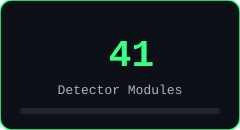</td>
<td>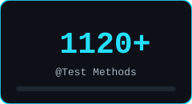</td>
<td>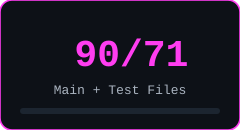</td>
</tr>
<tr>
<td>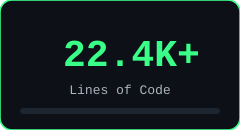</td>
<td>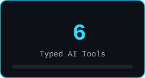</td>
<td></td>
</tr>
</table>

<sub>Stats reflect the `v1.34.5` snapshot in this repository. See [Changelog Highlights](#-changelog-highlights) for how the project got here.</sub>


## 🏗️ Architecture — Every Layer, Explained

LawCyBUG is organized into **seven layers**, each with a single, well-defined responsibility. Data flows *down* from the UI as commands, and *up* from the Montoya API as raw HTTP traffic — the AI Agent, Orchestration, and Detection layers meet in the middle.

<div align="center">

</div>

### 1. UI Layer — `LawCyBugTab`

A ~2,200-line Swing panel (`pro.lawcybug.scanner.ui`) that is the single control surface for the whole extension. It exposes:

- **Scan controls** — target scope, active/passive toggle per detector category.
- **Autonomous panel** — Start / Pause / Resume / Stop buttons (correct enablement: *Resume* only re-enables after a genuine pause, never after natural completion), plus the **AI Recon** trigger button.
- **Queue panel** — a host-list field and Start Queue / Stop Queue controls for unattended multi-target runs.
- **History dialog** — browses `AutonomousRunHistory`, with a one-click **Export History (Markdown)** button.
- **Export controls** — JSON / CSV / SARIF, and the **Export Client Report (HTML)** button wired to `HtmlReportGenerator`.
- **Housekeeping actions** — Clear History, Clear Request Audit Log, Clear Baseline for Host (single-host or bulk).
- **Live version label** — reads the jar's own `Implementation-Version` manifest attribute at runtime, falling back to `"dev build"` rather than a stale hardcoded string.

A shared `wireOrchestrator(orchestrator, queueMode, onIdle, onChainsChanged)` helper centralizes the event-listener wiring that used to be triplicated across single-run and queue-run code paths, with a `queueMode` flag so per-host state transitions inside a queue don't spuriously reset the single-run button states.

### 2. Orchestration Layer — `AutonomousExploitOrchestrator` + `ChainGuard`

The **decision-making core**. It doesn't detect vulnerabilities itself — it decides *what to work on next*, *whether it's allowed to*, and *when to stop*. See [Autonomous Exploit Orchestrator](#-autonomous-exploit-orchestrator) and [Safety Model](#-safety-model--chainguard--safe-mode) below for the full breakdown.

### 3. AI Agent Layer — the agentic core

Five cooperating classes (`pro.lawcybug.scanner.ai.*`) that give the extension genuine tool-using AI behavior instead of prompt-and-parse text scraping. Covered in full detail in [The AI Agentic Core, Step by Step](#-the-ai-agentic-core-step-by-step).

### 4. Detection Layer — 41 detector modules

Each detector lives in its own package under `pro.lawcybug.scanner.detectors.*`, implements a common detector interface, and is independently registered in `LawCyBugExtension`. Detectors are split into **active** (send probing traffic), **passive** (observe existing traffic only), and **stateful** (track identity/session graphs across multiple requests) classes. Full catalog: [Detector Catalog](#-detector-catalog--all-41-modules).

### 5. Evidence Layer — proving a finding is real

Three classes stand between "the AI *thinks* this is vulnerable" and "this is a **CONFIRMED** finding":

- **`ExploitEvidenceValidator`** — per-category signature banks (12+ vulnerability classes) that independently verify an AI claim against real response evidence, rather than trusting the model's own assertion.
- **`DifferentialProbeHelper`** — a 3-step **baseline → control → adaptive-threshold** comparison used by every differential detector (SQLi, NoSQLi, IDOR, XPath, LDAP, etc.) to separate a genuine signal from response noise.
- **`ResponseSimilarityEngine`** — the shared similarity-scoring engine (byte-length, structural, and content-based comparison) that both the evidence validator and the stateful workflow engine call into.

### 6. Persistence Layer — surviving restarts

Everything that needs to outlive a single scan, or a Burp restart entirely:

- **`FindingsStore`** — thread-safe findings persistence, including AI confirmation state/notes (fixed in v1.33.x — see [Changelog Highlights](#-changelog-highlights)) so the orchestrator never re-attempts AI exploitation on already-processed findings after a restart.
- **`AutonomousRunHistory`** — append-only, persistent, base64-encoded run summaries, newest-first, surviving restarts, exported to Markdown with correctly-ordered run numbering.
- **`AiPentestMemory`** — a per-engagement scratchpad, **isolated by target host** (see [AiPentestMemory](#aipentestmemory--per-engagement-scratchpad)).
- **`RequestAuditLog`** — a full audit trail of every request the extension itself has sent, independent of Burp's own history.
- **`ScanHistoryTracker`** — per-host baselines for differential/regression scanning across sessions.

### 7. Montoya API / Burp Suite Core

The foundation layer: HTTP request/response primitives, Burp Collaborator for out-of-band confirmation, the Scanner/Proxy/WebSocket event streams LawCyBUG listens on, and issue reporting back into Burp's native findings UI. LawCyBUG targets **Montoya API 2026.4** specifically and is compile-verified against that exact pinned tag (not just "whatever the latest Maven Central artifact is").


## 🤖 The AI Agentic Core, Step by Step

This is the headline capability of LawCyBUG, and the part most worth understanding in depth. It lives entirely under `pro.lawcybug.scanner.ai`.

<div align="center">
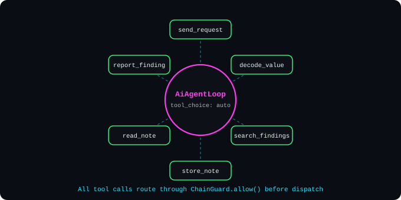
</div>

### AiAgentLoop — typed tool-calling

Older "AI security tools" typically work like this: *ask the model to write prose describing what to do, then regex-parse the prose to figure out an action.* This is brittle — the model can phrase things unpredictably, and the parser has to guess.

LawCyBUG's `AiAgentLoop` instead runs a **proper OpenAI-style tool-calling loop**:

1. The AI is given the finding context, the request/response pair, and the full **`AiToolRegistry`** tool schema, with `tool_choice: auto`.
2. If the model calls a tool, `AiToolExecutor` dispatches it to a **real, typed action** — no regex extraction from free text required.
3. The tool's result is returned to the model as a proper `role: tool` message.
4. The model reasons over the *structured* result and decides its next move — call another tool, or conclude.
5. If the target AI endpoint doesn't support the `tools` field (returns an error on it), the loop **gracefully degrades** to the legacy text-parsing path rather than failing outright.

```
AI writes prose → regex-parse → guess a mutation → apply        ❌ old path
AI calls a typed tool → executor applies exactly what was specified
   → typed result returned → AI reasons with full context        ✅ AiAgentLoop
```

### The 6 AI tools, explained

| Tool | What it does |
|---|---|
| `send_request` | Sends an HTTP request with AI-specified method/path/headers/body. **Gated through `ChainGuard.allow(method)` before dispatch** — see [Safety Model](#-safety-model--chainguard--safe-mode). |
| `decode_value` | Decodes a value (base64, URL-encoding, JWT segments, etc.) so the model can reason about encoded data without hallucinating its contents. |
| `search_findings` | Lets the AI query already-discovered findings for cross-referencing during chain reasoning. |
| `store_note` | Writes to the per-host `AiPentestMemory` scratchpad — persists across the whole engagement. |
| `read_note` | Reads back previously stored notes for the *current* target host only. |
| `report_finding` | Files a typed, structured finding — no regex extraction needed to turn an AI conclusion into a real Burp issue. |

`AiToolExecutor` performs **smart parameter routing** for `send_request` — it detects whether the target expects a JSON body, form-encoded body, or query-string parameters, and shapes the AI's typed arguments accordingly rather than requiring the model to know the wire format itself.

### AiAdaptiveExploitEngine

The **multi-turn exploitation engine**. Given a candidate finding, it:

1. Tries `AiAgentLoop` (typed tool-calling) first, for any tool-capable AI endpoint.
2. Falls back to the legacy text-parsing path only if the endpoint signals it doesn't support tools.
3. Calls `classify()`, which combines the AI's own claim with `ExploitEvidenceValidator`'s independent evidence check — **the AI's opinion alone is never sufficient** to mark a finding CONFIRMED.
4. Runs genuinely **multi-turn**: a single exploitation attempt can span several request/response round-trips, not a single fire-and-forget probe.

### AiChainSynthesizer

Looks across the findings store for combinations that are individually low-severity but **jointly exploitable** — e.g. an IDOR that only matters *because* a separate mass-assignment bug lets you set the object's owner field first. Produces chain candidates that the orchestrator can then work.

### AiPayloadMutator

A **generate → fire → validate** loop (not "generate and hope"): proposes a payload variant, fires it, checks the real response against expected signatures, and iterates only when validation actually supports doing so.

### AiReconAgent — autonomous reconnaissance

AI-driven active recon, invoked from the "🔍 AI Recon" button in the Autonomous panel:

1. Describes the observed traffic surface to the AI model.
2. The AI hypothesizes **unvisited paths** likely to exist based on the surface it's seen (e.g. `/api/v1/users` seen → hypothesize `/api/v1/users/export`).
3. Fires real `httpRequestFromUrl` probes — capped at **3 rounds × 8 probes** to bound cost and noise.
4. Interesting responses are registered as `INFORMATION`-severity findings for the operator to triage.
5. **Scope-enforced**: checks `AutonomousExploitOrchestrator.parseHostAllowlist()` / `isHostAllowed()` before probing the operator-typed target, so a mistyped or pasted out-of-scope host fails fast with a clear error instead of silently probing it.

### AiPentestMemory — per-engagement scratchpad

A persistent, host-isolated notes store (`~/.lawcybug/pentest-memory.txt`) exposed to the AI via `store_note` / `read_note`, and to `AiReconAgent`'s "previously stored reconnaissance notes" context.

**Why host isolation matters:** this is a multi-engagement pentest tool. Notes taken while testing Client A's application — extracted tokens, discovered admin paths, anything the AI decided was worth remembering — must never surface while testing Client B, even in the same Burp session weeks later. `DetectorContext` maintains one `AiPentestMemory` instance **per normalized host**, all backed by the same on-disk file, keyed through a static `normalizeHost(String urlOrHost)` helper that:

- accepts either a full URL or a bare host,
- strips scheme/port/path/query,
- lowercases consistently,
- falls back to the raw lowercased input if unparseable, and `"unknown"` if null/blank.

This guarantees two properties that matter far more than they might sound: **different hosts never collide**, and **the same host always matches** regardless of which specific path or query string triggered the lookup.


## 🕸️ Autonomous Exploit Orchestrator

`AutonomousExploitOrchestrator` is the layer that turns "a pile of detectors and an AI agent" into an actual **autonomous run**.

### State machine

<div align="center">
</div>

- **IDLE → RUNNING** via `start()`.
- **RUNNING → PAUSED** via `pause()` (an explicit, resumable stop).
- **PAUSED → RESUMING → RUNNING** via `resume()` — and this is a **genuine** resume, not just "start over": counters, in-flight chain state, and AI confirmation progress are preserved (see [Run History & Cross-Restart Resume](#run-history--cross-restart-resume) below for how this survives even a full Burp restart).
- **RUNNING → QUEUEING** via `startQueue()` for multi-target unattended runs.
- **QUEUEING → STOPPED** via `stopQueue()`, or **RUNNING → STOPPED** via `stop()` for a full, non-resumable halt.

### Chain risk scoring

Rather than working pending chains in arbitrary discovery order, the orchestrator computes a `chainRiskScore` for every pending chain:

```
chainRiskScore = (severity × 100) + (steps × 10) + (highSeverityFindings × 5) + (inProgressBoost × 50)
```

Pending work is then processed **highest-risk-first**, with a confidence tiebreak inside `nextCandidates()` when two chains score equally. In practice this means a 2-step chain that already contains a HIGH-severity confirmed finding gets worked before a longer but lower-confidence 4-step speculative chain.

### Multi-target queue mode

<div align="center">
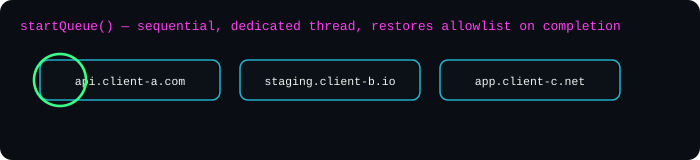
</div>

`startQueue()` / `stopQueue()` run the full autonomous loop **sequentially** across a list of hosts, on its own dedicated thread, and **restore the original host allowlist** on completion — so a queue run never permanently widens your engagement scope. This is the mechanism behind unattended overnight runs across an entire multi-target engagement.

### Run history & cross-restart resume

`AutonomousRunHistory` persists every run's summary — append-only, base64-encoded, newest-first — to `autonomous-run-history.txt` in the extension's home directory, so it's available again the moment Burp restarts. The History dialog in the UI reads from it directly, and **Export History (Markdown)** calls `AutonomousRunHistory.toMarkdown()` to produce a shareable record (correctly numbered newest-first as **Run 1** — see [Changelog Highlights](#-changelog-highlights) for the numbering-order bug this fixed).

Cross-restart *resume* itself is built **on top of** the existing `FindingsStore` persistence rather than a separate checkpoint file: `nextCandidates()` / `resolveChains()` already filter on `aiConfirmationState == NOT_ATTEMPTED`, so once that field round-trips correctly through persistence, resuming after a full Burp restart falls out for free — no parallel disk-checkpoint system needed.


## 🛡️ Safety Model — ChainGuard & Safe Mode

LawCyBUG sends real, mutating HTTP requests during active detection and AI-driven exploitation. That capability is only responsible if it is **impossible to bypass accidentally** — including by the extension's own AI agent. This is treated as a first-class design constraint, not an afterthought.

<div align="center">
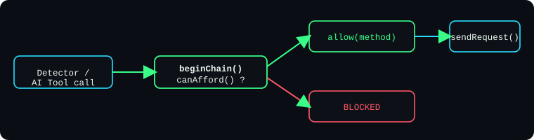
<br/>
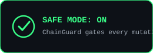
</div>

**How it works:**

- Every mutating call — whether from a Java detector *or* from the AI agent's `send_request` tool — must call `ChainGuard.beginChain()` once per exploit attempt, then `ChainGuard.allow(method)` immediately before dispatch.
- `canAfford()` provides pre-flight budget checks for burst-style probing (e.g. `RaceConditionDetector`'s concurrent burst), so a single detector can't exhaust the mutation budget for an entire chain.
- A request that fails the `allow()` check is **blocked before it is ever sent** — not logged-and-sent, not sent-then-flagged.

**Why this needed repeated fixing (and what that says about the project):** the ChainGuard gating rule is simple to state — *"every mutating call must be gated"* — but easy to reintroduce a gap for, because new code paths keep getting added. This bug class was found and fixed **six times** across the project's history:

- **v1.1.0–v1.2.0**: six original confirmation detectors (`MassAssignmentConfirmDetector`, `RaceConditionDetector`, `IdorAuthorizationDetector`, `CrossIdentityBolaDetector`, `AuthzBypassDetector`, `AccountTakeoverDetector`) were sending mutating requests with **zero** ChainGuard participation. Fixed, and a regression suite (`ChainGuardTest`) was added specifically to catch a recurrence.
- **v1.29.0**: the same gap reappeared in a *different* six detectors as the project grew — caught and fixed in the same release that shipped the autonomous orchestrator's chain-resolution logic.
- **v1.34.1**: the gap showed up again, this time **inside the new AI agentic tool loop itself** — `AiToolExecutor.executeSendRequest()` (the `send_request` tool) dispatched AI-controlled requests straight to `sendRequest()` with no ChainGuard gating at all. Since `AiAdaptiveExploitEngine` tries the tool-calling path *first* for any tool-capable model, this meant the **default** AI-exploit path was shipping with Safe Mode silently unenforced. Fixed by gating the dispatch behind `ChainGuard.allow(method)` and calling `beginChain()` once per `AiAgentLoop.run()` so the per-finding budget correctly resets on each new exploit attempt.

**The pattern, generalized:** ChainGuard's own gating logic is correct and exhaustively unit-tested by `ChainGuardTest`. Every real incident has been a **new caller forgetting to invoke it**, not a flaw in the guard itself — which is why every new mutating code path (detector, AI tool, recon probe) gets an explicit ChainGuard-call check during review, not an assumption that "the guard will catch it."

**Scope enforcement is a separate, complementary control:** `AutonomousExploitOrchestrator.parseHostAllowlist()` / `isHostAllowed()` govern *which hosts* autonomous activity is even allowed to touch, independent of ChainGuard's *which HTTP methods* control. Both `AutonomousExploitOrchestrator` and `AiReconAgent` check the allowlist before acting — the latter was retrofitted in v1.34.2 after review found it had zero scope enforcement despite every sibling autonomous action having it.


## 🔬 Detector Catalog — All 41 Modules

Every detector below lives in its own package under `pro.lawcybug.scanner.detectors.*` and is independently registered in `LawCyBugExtension`. Detectors are grouped by category, not by discovery order.

<sub>🔴 Active · 🟠 Active (Tentative confidence) · 🔵 Stateful · 🟢 Protocol · 🟣 Infrastructure · ⚪ Passive</sub>

### Injection Detectors

| | Detector | Class | Description |
|---|---|---|---|
| | Detector | Core Class | Description |
|---|---|---|---|
|  | **SQL Injection** | `SqlInjectionDetector` | Boolean/time/error-based differential probing across body, query, header, and JSON injection points; baseline→control→adaptive-threshold verification. |
|  | **NoSQL Injection** | `NoSqlInjectionDetector` | MongoDB/CouchDB-style operator injection (`$where`, `$ne`, `$gt`), auth-bypass payloads, differential response confirmation. |
|  | **Cross-Site Scripting** | `XssDetector` | Reflected/stored/DOM XSS probing with context-aware payload selection and reflection-point analysis. |
|  | **OS Command Injection** | `CommandInjectionDetector` | Time-based and OOB (Collaborator) command injection across shells, with chained payload mutation on partial success. |
|  | **SSRF + Blind SSTI (OOB)** | `SsrfCollaboratorDetector / SstiCollaboratorDetector` | Collaborator-backed SSRF probing plus per-template-engine blind SSTI detection (Jinja2, FreeMarker, Velocity, Java EL, Twig, Smarty). |
|  | **XML External Entity Injection** | `XxeDetector` | Classic + OOB XXE via Collaborator, blind exfiltration and error-based variants. |
|  | **Insecure Deserialization** | `DeserializationDetector` | Java/PHP/.NET gadget-chain probing with OOB Collaborator confirmation for blind cases. |
|  | **Log4Shell (CVE-2021-44228)** | `Log4ShellDetector` | JNDI lookup injection across headers/params/body with Collaborator-based confirmation. |
|  | **Path Traversal** | `PathTraversalDetector` | Encoded/double-encoded/OS-specific traversal sequences with response-content differential validation. |
|  | **Host Header Injection** | `HostHeaderDetector` | Password-reset poisoning, cache-key confusion, and routing-bypass Host header attacks. |
|  | **CRLF Injection** | `CrlfInjectionDetector` | Header/response-splitting injection via encoded CR/LF sequences. |
|  | **Prototype Pollution** | `PrototypePollutionDetector` | `__proto__` / `constructor.prototype` JSON body pollution with behavioral confirmation. |
|  | **Insecure File Upload** | `FileUploadDetector` | Extension/MIME/magic-byte bypass probing, polyglot payloads, path-based execution checks. |
|  | **LDAP Injection** | `LdapInjectionDetector` | Filter-injection payloads for auth-bypass and blind boolean LDAP queries. |
|  | **HTTP Parameter Pollution** | `HppDetector` | Duplicate-parameter behavior divergence across frameworks (last-wins/first-wins/array-merge). |
|  | **XPath Injection** | `XPathInjectionDetector` | Boolean-based blind XPath injection with differential confirmation. |
|  | **CSV Formula Injection** | `CsvFormulaInjectionDetector` | Passive check flagging CSV/spreadsheet export responses containing unsanitized formula-trigger cells (`=`, `+`, `-`, `@`). |

### Protocol & Desync Detectors

| | Detector | Core Class | Description |
|---|---|---|---|
|  | **HTTP Request Smuggling** | `SmugglingDetector` | CL.TE / TE.CL / TE.TE desync timing and differential probes. |
|  | **HTTP/2 Smuggling (H2.TE / H2.CL)** | `Http2SmugglingDetector` | H2-specific desync timing probes; **TENTATIVE only** since the Montoya API has no per-request visibility into whether HTTP/2 was actually negotiated with the target. |
|  | **Web Cache Poisoning** | `WebCachePoisoningDetector` | Unkeyed header/parameter cache-poisoning probes with response-divergence confirmation. |
|  | **Web Cache Deception** | `WebCacheDeceptionDetector` | Path-confusion suffix probing on authenticated endpoints, confirmed via an anonymous-credential-stripped re-request. |

### Stateful & Workflow Detectors

| | Detector | Core Class | Description |
|---|---|---|---|
|  | **IDOR Authorization** | `IdorAuthorizationDetector` | Object-graph based cross-object access probing with `ResponseSimilarityEngine` baseline comparison. |
|  | **Cross-Identity BOLA** | `CrossIdentityBolaDetector` | Multi-identity session-graph swapping to confirm broken object-level authorization across accounts. |
|  | **Authorization Bypass** | `AuthzBypassDetector` | Forced-browsing / method-override / role-parameter authorization bypass with session-aware verification. |
|  | **Mass Assignment** | `MassAssignmentConfirmDetector` | Hidden-field / privileged-property injection into write endpoints, confirmed via ChainGuard-gated mutation. |
|  | **Race Condition** | `RaceConditionDetector` | Concurrent-burst request firing (`WorkflowEngine.runConcurrentBurst`) with `canAfford()` pre-flight budget checks. |
|  | **Account Takeover Chain** | `AccountTakeoverDetector` | Multi-step chained probing across password-reset / registration / SSO flows. |
|  | **Business Logic Abuse** | `BusinessLogicAbuseDetector` | Workflow-state and sequencing abuse — skip-step, replay, quantity/price manipulation. |
|  | **Privilege Escalation Chain** | `FindingsCorrelator (chain layer)` | Cross-finding chain resolution linking low-severity issues into a full privilege-escalation path. |

### Identity & Auth Protocol Detectors

| | Detector | Core Class | Description |
|---|---|---|---|
|  | **OAuth 2.0 / OIDC Suite** | `OAuthSuiteDetector` | Redirect-URI validation, state/PKCE checks, token-leakage, and implicit-flow misconfiguration probing. |
|  | **JWT Security** | `JwtSecurityDetector` | `alg:none`, key-confusion, weak-secret brute force, signature-stripping, and claim-tampering checks. |
|  | **SAML Security** | `SamlSecurityDetector` | Decodes SAMLResponse/SAMLRequest (POST + Redirect bindings); flags unsigned assertions, XSW preconditions (multi-Assertion/Response), Reference/ID mismatch, weak SHA-1 signature algorithms. |
|  | **WebAuthn Downgrade** | `WebAuthnDowngradeDetector` | Flags missing `userVerification`, missing `excludeCredentials`, same-response password fallback, and `attestation: none` on high-assurance paths. |

### API & Modern Stack Detectors

| | Detector | Core Class | Description |
|---|---|---|---|
|  | **GraphQL Suite** | `GraphQlSuiteDetector` | Introspection exposure, batching abuse, GET-based mutation checks, depth/complexity probing (read-only queries excluded from false positives). |
|  | **gRPC-Web Security** | `GrpcWebSecurityDetector` | Flags unauthenticated server reflection, verbose `grpc-message` leakage, and cleartext transport. |
|  | **Kubernetes API Exposure** | `KubernetesApiExposureDetector` | Flags exposed API server / kubelet / etcd endpoints and leaked service-account JWTs via a real base64url payload decode (not a substring match). |
|  | **WebSocket Passive Inspection** | `WebSocketInspectionDetector` | Passive inspection of WebSocket handshakes and frames for the same signature classes as HTTP traffic. |

### Passive & Configuration Detectors

| | Detector | Core Class | Description |
|---|---|---|---|
|  | **Security Headers** | `SecurityHeadersDetector` | CSP, HSTS, X-Frame-Options, Referrer-Policy, and related response-header hardening checks. |
|  | **CORS Misconfiguration** | `CorsDetector` | Origin-reflection, null-origin, wildcard + credentials, and delimiter-suffix bypass detection, including `Vary: Origin` checks. |
|  | **Information Disclosure** | `InfoDisclosureDetector` | Stack traces, debug endpoints, verbose errors, and source-map / backup-file exposure. |
|  | **Open Redirect** | `OpenRedirectDetector` | Unvalidated redirect-target detection with echoed-value false-positive filtering. |


## 🧩 Stateful Workflow Engine

Several detectors above are marked **Stateful** because a single request/response pair is not enough evidence — they need to track *identity* and *state* across a sequence of requests. This is what `pro.lawcybug.scanner.workflow` provides:

| Component | Responsibility |
|---|---|
| `SessionIdentity` | Represents a distinct authenticated identity (account/session/token) the engine can act as, so detectors can compare behavior *across* identities, not just across requests. |
| `ObjectGraph` | Tracks object references (IDs, resource paths) observed across traffic, so IDOR/BOLA detectors know which objects belong to which identity. |
| `ResponseSimilarityEngine` | Byte-length / structural / content-based similarity scoring shared by the evidence layer and the stateful detectors. |
| `WorkflowEngine` | Executes multi-step probing sequences, including `runConcurrentBurst()` — fires a burst of near-simultaneous requests for race-condition testing, called by `BusinessLogicAbuseDetector` and gated by `ChainGuard.canAfford()`. |
| `ChainGuard` | The safety gate described in [Safety Model](#-safety-model--chainguard--safe-mode) — lives conceptually here since it's the workflow engine's own mutation budget. |


## 🔄 Findings Pipeline — From Signal to Report

```
   Raw traffic (Proxy/Scanner/WebSocket)
            │
            ▼
   41 Detector modules  ──────────────►  EndpointClassifier
            │                                    │
            ▼                                    ▼
   Candidate signal              (labels endpoint type: API/form/upload/auth/etc.)
            │
            ▼
   ExploitEvidenceValidator  ◄──── DifferentialProbeHelper (baseline→control→threshold)
            │
            ▼
   AiAdaptiveExploitEngine.classify()  (AI claim + independent evidence, never AI-alone)
            │
            ▼
   FindingsStore  ──────►  FindingsCorrelator  ──────►  AiChainSynthesizer
            │                      │                          │
            ▼                      ▼                          ▼
   SeverityRecalibrator   Cross-finding chains      AutonomousExploitOrchestrator
   (fixes HIGH+TENTATIVE        │                    (chain-risk-scored work order)
    misfiled as P1)             ▼
            │              chainRiskScore ranking
            ▼
   FindingsSuppressionEngine  (learned false-positive suppression)
            │
            ▼
   IssueFactory.build()  ──────►  Burp native Issues panel
            │
            ▼
   FindingsExporter  ──────►  JSON · CSV · SARIF · HtmlReportGenerator
```

Key pipeline safeguards worth calling out explicitly:

- **`SeverityRecalibrator`** is wired directly into `IssueFactory.build()` specifically to stop HIGH-severity-but-TENTATIVE-confidence findings from surfacing as P1 in Burp's issue list — confidence and severity are tracked as genuinely separate dimensions.
- **`FindingsSuppressionEngine`** lets the operator mark a recurring pattern as a known false positive *once*, and have it suppressed automatically across the rest of the engagement and future scans of the same host.
- **`ScanHistoryTracker`** maintains true per-host baselines (`Map<String,Set<String>>` / `Map<String,BaselineMeta>`), so cross-session regression scanning never conflates findings between two different targets.


## 📑 Reporting & Export

| Format | Where it's for |
|---|---|
| **JSON** | Programmatic consumption, tooling integration, archival. |
| **CSV** | Spreadsheet triage, quick filtering/sorting by severity or host. |
| **SARIF** | CI/CD pipeline ingestion (GitHub code scanning, etc.) — includes correct CRITICAL-level mapping. |
| **HTML (`HtmlReportGenerator`)** | Self-contained, single-file **client-facing report** — executive summary, severity bars, expandable per-finding detail. No PDF library dependency: the browser's own print-to-PDF covers that need. |
| **Run History (Markdown)** | `AutonomousRunHistory.toMarkdown()` — a plain-text record of every autonomous run, correctly numbered newest-first as Run 1. |

All export formats pull from the same `FindingsStore`, so a JSON export, a SARIF upload, and the HTML client report are always consistent with each other and with what's shown in the UI.


## ✅ Requirements

| Requirement | Version / Notes |
|---|---|
| **Burp Suite** | Professional or Community, any build supporting the Montoya API |
| **Montoya API** | `2026.4` (pinned — see [Building From Source](#-building-from-source) for why the exact tag matters) |
| **Java** | 17 (target/source level) |
| **Maven** | 3.8+ (`mvn clean package` is the verified build command) |
| **OS** | Verified on Parrot OS; any OS with a working JDK 17 + Maven toolchain should work |
| **AI provider (optional but recommended)** | Any OpenAI-compatible chat-completions endpoint — OpenAI, OpenRouter, Grok, or a Cloudflare AI Gateway in front of any of them |

> Detectors, the Stateful Workflow Engine, and manual scanning all work **without** an AI provider configured. The AI Agent Layer (adaptive exploitation, chain synthesis, recon agent) requires an API key.


## 📦 Installation

<div align="center">

</div>

1. Download or build the extension jar (`lawcybug-pro-scanner-<version>.jar`) — see [Building From Source](#-building-from-source) below.
2. In Burp Suite, go to **Extensions → Installed → Add**.
3. Set **Extension type** to `Java`.
4. Select the jar file and click **Next**.
5. Confirm the **LawCyBUG** tab appears alongside Burp's native tabs (Proxy, Target, etc.).
6. Open the tab and confirm the version label in the header matches the jar you built.


## 🔨 Building From Source

```bash
git clone <this-repository-url> lawcybug
cd lawcybug
mvn clean package
```

The packaged jar lands in `target/lawcybug-pro-scanner-<version>.jar`.

### A note on Montoya API version pinning

LawCyBUG is compiled and verified against the **exact pinned `2026.4` tag** of the Montoya API, not just "whatever's newest." This matters because API surfaces genuinely change between versions — this project has previously caught a real pre-existing bug (a non-exhaustive `switch` over `AuditIssueSeverity` missing the `FALSE_POSITIVE` enum value, confirmed present as far back as the `2026.4` tag) that had never been caught before because the project had never previously been compiled with a strict, version-matched `javac` + Montoya API pairing.

If you're building against a different Montoya API version, **recompile and re-run the test suite before trusting the output** — API surface drift is a real risk, not a hypothetical one, for an extension this deeply integrated with Burp's internals.


## 🚀 Quick Start — Your First Autonomous Run

<div align="center">

</div>

1. **Install the extension** (see above) and open the **LawCyBUG** tab.
2. **Set your scope** — enter the target host(s) in the Host Allowlist field. Nothing autonomous runs outside this allowlist; see [Host Allowlisting & Scope Control](#host-allowlisting--scope-control).
3. **Browse the target normally through Burp's Proxy** for a few minutes first — passive detectors and `EndpointClassifier` learn from real traffic, and `AiReconAgent` hypothesizes from what it's already seen, so a warm traffic corpus produces sharper results than a cold start.
4. **(Optional) Configure an AI provider** — see [AI Provider Setup](#ai-provider-setup) below. Skip this step to run detector-only scanning with no AI involvement.
5. **Enable Safe Mode confirmation** (on by default) and review the ChainGuard budget settings if you want to tune how aggressive autonomous mutation is allowed to be.
6. Click **▶ Start** in the Autonomous panel.
7. Watch the live findings list populate; chains resolve in risk-score order (see [Chain Risk Scoring](#chain-risk-scoring)).
8. Use **⏸ Pause** any time — the orchestrator preserves exact progress and **▶ Resume** picks back up, even across a Burp restart.
9. When finished, click **Export Client Report (HTML)** for a client-ready deliverable, or use JSON/CSV/SARIF for tooling integration.
10. Review **History → Export History (Markdown)** for a full run-by-run record of the engagement.

For an unattended multi-target engagement, use the **Queue** panel instead of step 6 — paste your host list and click **Start Queue**; see [Multi-Target Queue Mode](#multi-target-queue-mode).


## ⚙️ Configuration Reference

### AI Provider Setup

LawCyBUG's `AiTriageClient` and `AiAgentLoop` speak the standard OpenAI **chat-completions** wire format, so any compatible endpoint works:

| Provider | Notes |
|---|---|
| **OpenAI** | Standard `api.openai.com` endpoint + API key. |
| **OpenRouter** | Preset included — route to any model OpenRouter exposes through one key. |
| **Grok (xAI)** | Preset included. |
| **Cloudflare AI Gateway** | Preset included — put the gateway in front of any of the above for logging/caching/rate-limiting at the edge. |

Configuration lives in the **AI Settings** section of the LawCyBUG tab:

1. Select a provider preset (or enter a custom base URL for any OpenAI-compatible endpoint).
2. Paste your API key. **Rotate any key you paste into a shared or exported configuration** — see [Security & Responsible Use](#-security--responsible-use).
3. Choose a model. Tool-calling support is auto-detected at runtime (`AiAgentLoop` degrades gracefully if the endpoint rejects the `tools` field).
4. `AiTriageClient.sendWithRetry()` handles transient failures automatically — exponential backoff with linear retry (`500ms × attempt`) on `429`/`5xx` responses, and the `AutonomousExploitOrchestrator` itself auto-pauses after 3 consecutive errors (or 6 for lighter faults) rather than burning through a run against a failing endpoint.

### Engagement Profiles

`EngagementProfile` captures a filtered, curated snapshot of your current detector/scope/AI configuration (via `captureFrom()`) so you can **save and reload** a specific engagement's settings rather than reconfiguring from scratch each session. This is deliberately more careful than a blind settings dump — `ScanSettings.snapshotToggles()` exists internally but is *not* wired to the UI, because it would capture stale detector IDs from previous versions; `EngagementProfile.captureFrom()` is the supported save/load path.

### Host Allowlisting & Scope Control

The single most important safety control in the whole extension: **nothing autonomous** — orchestrator runs, AI Recon, queue-mode runs — touches a host that isn't on the allowlist.

- `AutonomousExploitOrchestrator.parseHostAllowlist()` / `isHostAllowed()` are the shared, public, statically-testable implementation (covered by `AutonomousExploitOrchestratorChainResolutionTest`) — every autonomous entry point calls into the *same* logic rather than re-implementing scope checks.
- Queue-mode runs **restore the original allowlist** on completion, so a multi-target run never permanently widens your scope by accident.
- A mistyped or pasted out-of-scope host fails fast with a clear message rather than silently being probed.

### Custom Rule Packs

Beyond the 41 Java detector modules, LawCyBUG ships **287+ JSON detection rules** across rule packs for: secrets/credentials, SQL/NoSQL error signatures, SSTI per template engine, framework debug disclosure, security headers, cloud metadata SSRF, CMS-specific signatures, Web3/blockchain, cloud infrastructure, mobile API patterns, IoT/embedded signatures, message queues, CI/CD exposure, and a dedicated advanced-CVE pack (Log4Shell, Spring4Shell, Confluence OGNL, Java deserialization gadget hints, prototype-pollution-to-RCE, SpEL/EL injection, DOM clobbering, mutation XSS, polyglot XSS, and named CVE probes for MOVEit/TeamCity/OFBiz/XZ, among others).

An example rule pack is included at [`example-rules.json`](example-rules.json) — use it as a template for extending detection coverage without writing Java. Custom rule packs load through `CustomRuleEngine`.


## 🖥️ UI Walkthrough

| Panel | What you'll find there |
|---|---|
| **Scan** | Per-category detector toggles, target scope entry, manual scan trigger. |
| **Autonomous** | ▶ Start / ⏸ Pause / ▶ Resume / ⏹ Stop, 🔍 AI Recon trigger, live chain/finding counters. |
| **Queue** | Multi-host list field, Start Queue / Stop Queue, per-host progress indicator. |
| **Findings** | Live findings table with AI confirmation state, severity, and chain membership. |
| **History** | Persistent run-by-run record via `AutonomousRunHistory`, with Export History (Markdown) and Clear History. |
| **Audit Log** | Full record of every request LawCyBUG itself sent, independent of Burp's own Proxy history, with Clear Request Audit Log. |
| **Baselines** | Per-host scan baselines from `ScanHistoryTracker`, with single-host or bulk Clear Baseline actions. |
| **AI Settings** | Provider preset, base URL, API key, model selection. |
| **Export** | JSON / CSV / SARIF buttons plus Export Client Report (HTML). |


## 🧪 Testing & Verification

<table align="center">
<tr>
<td></td>
<td></td>
</tr>
</table>

- **1120+ `@Test` methods** across **71 test files**, alongside **90 main source files** (~22,400 lines of Java total).
- Build command: `mvn clean package` — verified on Parrot OS.
- Every code change is **compile-checked against the exact pinned Montoya API `2026.4` tag**, obtained via a fresh, exact-tag clone (`git clone --branch 2026.4 --depth 1 https://github.com/PortSwigger/burp-extensions-montoya-api.git`) — a `git checkout tags/X -- .` layered on top of a `HEAD` checkout is deliberately avoided, since it leaves stale newer-only files that reference APIs absent from the pinned tag and produces false compile errors.
- Test files are additionally type/syntax-checked by compiling against a hand-written JUnit5 stub (`Test`, `BeforeEach`, `Assertions` with a broad overload set, `@TempDir`, `Executable`) in sandboxed environments without Maven Central access — this catches compile errors but **not** assertion-logic failures, since stub assertion bodies are no-ops.
- **A real `mvn clean package` / `mvn test` run on a machine with full Maven Central access has repeatedly caught real bugs that pure compile-checking structurally cannot** — two separate defects were found this way in a single verification pass (`AiPentestMemory.clearSession()` not resetting the `loaded` flag, and `AutonomousRunHistory.toMarkdown()` numbering runs backwards). **If you're extending this project, periodically run a genuine `mvn test` rather than relying on compile-checks alone.**
- Previously zero-coverage packages (`sqli`, `xss`, `ssrf`, `idor`, `race`, `atochain`) were brought up to real test suites during the Aug 2026 accuracy/safety sweep.
- Regression coverage exists specifically for the safety-critical paths: `ChainGuardTest` for Safe Mode gating, `AutonomousExploitOrchestratorChainResolutionTest` for scope enforcement and chain resolution, `DetectorContextTest` for per-host memory isolation (11 assertions covering full-URL/port/case/bare-host/IP/null/blank/unparseable inputs).


## 📁 Project Structure

```
lawcybug/
├── pom.xml                          # Maven build (Java 17, Montoya API 2026.4)
├── README.md                        # You are here
├── CHANGELOG.md                     # Full reconstructed version history (v0.0.4 → current)
├── EULA.md                          # End-user license agreement (attorney review pending)
├── example-rules.json               # Sample custom JSON rule pack
└── src/
    ├── main/java/pro/lawcybug/scanner/
    │   ├── LawCyBugExtension.java   # Entry point — registers every detector + AI component
    │   ├── ai/                      # AI Agent Layer
    │   │   ├── AiTriageClient.java
    │   │   ├── adaptive/            # AiAdaptiveExploitEngine, AiChainSynthesizer, AiPayloadMutator
    │   │   ├── orchestrator/        # AutonomousExploitOrchestrator
    │   │   ├── recon/               # AiReconAgent
    │   │   ├── tools/                # AiToolRegistry, AiToolExecutor, AiAgentLoop
    │   │   └── memory/               # AiPentestMemory
    │   ├── audit/                   # RequestAuditLog
    │   ├── autoexploit/             # Exploit-attempt coordination
    │   ├── classification/          # EndpointClassifier
    │   ├── core/                    # DetectorContext, shared plumbing
    │   ├── detectors/               # 41 detector packages (see catalog above)
    │   ├── export/                  # FindingsExporter, HtmlReportGenerator
    │   ├── history/                 # AutonomousRunHistory, ScanHistoryTracker
    │   ├── learning/                # FindingsSuppressionEngine
    │   ├── profile/                 # EngagementProfile
    │   ├── rules/                   # CustomRuleEngine + 287+ JSON rules
    │   ├── ui/                      # LawCyBugTab
    │   ├── util/                    # Shared helpers (JsonUtil, etc.)
    │   └── workflow/                # WorkflowEngine, ChainGuard, ObjectGraph, SessionIdentity,
    │                                 # ResponseSimilarityEngine
    └── test/java/pro/lawcybug/scanner/   # 71 test files, 1120+ @Test methods, mirrors main/ layout
```


## 🔐 Security & Responsible Use

> **LawCyBUG is built exclusively for authorized penetration testing and bug bounty work carried out under an explicit engagement scope or program rules.**

- **Only test targets you are explicitly authorized to test.** Host allowlisting is provided as a safety control, not as a substitute for actual written authorization.
- **Safe Mode / ChainGuard should remain enabled** unless you have a specific, informed reason to disable it and a clear understanding of what unconstrained autonomous mutation means for the target.
- **Rotate any AI provider API key** before sharing configuration exports, screenshots, or engagement profiles — `EngagementProfile` snapshots are intentionally filtered but always review what you're sharing.
- **`AiPentestMemory` is host-isolated by design** specifically so notes from one client engagement can never leak into another — but the underlying file (`~/.lawcybug/pentest-memory.txt`) still contains real engagement data (extracted tokens, discovered paths) across *all* hosts you've tested. Treat it like any other sensitive engagement artifact: back it up securely, and clear it when an engagement concludes if your client agreement requires data destruction.
- **`EULA.md` is currently in draft** and has not yet received attorney review — do not treat it as a finalized legal document until that review is complete.
- Findings marked **CONFIRMED** have passed independent evidence validation (`ExploitEvidenceValidator`), not just an AI model's own assertion — but **always manually verify before including a finding in a client deliverable.** Automated confirmation reduces false positives; it does not eliminate the need for human review on anything that will appear in a report with your name on it.


## 🗺️ Roadmap

- [ ] Attorney review of `EULA.md`
- [ ] Rotation/removal of any residual exposed provider keys from historical exports
- [ ] Expand `mvn test`-verified (not just compile-checked) coverage for AI agentic tool paths that require a real `MontoyaApi` instance
- [ ] Additional CVE rule-pack entries as new high-impact disclosures land
- [ ] Broader HTTP/2-native confirmation once the Montoya API exposes per-request protocol visibility (currently blocks `Http2SmugglingDetector` from moving past TENTATIVE)
- [ ] Continued systematic backend-to-UI wiring sweeps as new detector/orchestrator features ship


## 📜 Changelog Highlights

<sub>Full detail in [CHANGELOG.md](CHANGELOG.md). This section covers the arc of the project, not every point release.</sub>

| Version | Highlight |
|---|---|
| **v0.0.4** | Foundations — 287 JSON detection rules across four rule packs, five stateful Java detectors, `RequestFingerprintGuard` to fix a request-multiplication bug, advanced CVE rule pack (23 rules incl. Log4Shell, Spring4Shell, Confluence OGNL). |
| **v1.1.0** | **Critical safety fix** — six confirmation detectors found sending mutating requests with zero ChainGuard participation; fixed, plus `ChainGuardTest` regression suite added. |
| **v1.1.0–v1.2.0** | Extended from ~5,300 lines/14 detectors to ~11,800 lines/50+ files. Stateful Workflow Engine built (`SessionIdentity`, `ObjectGraph`, `ResponseSimilarityEngine`, `WorkflowEngine`), Cross-Identity BOLA/IDOR, Privilege Escalation Chain, Business Logic Abuse, OAuth/OIDC Suite, GraphQL Suite, AI triage (OpenAI-compatible incl. OpenRouter), AI Auto-Exploit, WebSocket passive inspection. |
| **v1.2.0–v1.4.4** | Full static read of the (then) 124-file codebase; root-caused four systemic issues (string-matching-only AI confirmation, missing baseline re-sampling, a static-vs-instance method bug, an inert payload mutator) and rebuilt each properly — `VulnCategoryMapper`, `ExploitEvidenceValidator`, `DifferentialProbeHelper`, a real generate-fire-validate `AiPayloadMutator`. |
| **v1.4.4→v1.29.0** | Comprehensive accuracy/safety sweep across all 30+ detector modules; `SeverityRecalibrator` added; concrete bug fixes across NoSQL/JWT/open-redirect/IDOR/InfoDisclosure/GraphQL/CORS detectors; brought previously zero-coverage packages up to real test suites. |
| **v1.29.0** | Major autonomous agentic exploit loop shipped (`AutonomousExploitOrchestrator`, `AutonomousRunHistory`) with chain resolution, cross-step context passing, host scoping, per-run summaries. **Also fixed the ChainGuard-gating bug for a second time**, this time across six *different* detectors, plus four new detectors (HPP, XPath, HTTP request smuggling, enhanced business-logic abuse). |
| **v1.30.0** | "Backoff" release — exponential backoff + auto-pause (after 3/6 consecutive errors) on the orchestrator; retry-with-backoff on `AiTriageClient`. |
| **v1.31.0** | `AutonomousRunHistory` made genuinely persistent across Burp restarts, wired into the UI with a History dialog and Markdown export. |
| **v1.32.0** | Three new detectors (CSV Formula Injection, Web Cache Deception, SAML Security) plus `chainRiskScore`-based work ordering in the orchestrator. |
| **v1.33.0** | Five more detectors (blind SSTI via Collaborator, gRPC-Web, Kubernetes API exposure, WebAuthn downgrade, HTTP/2 smuggling) plus `HtmlReportGenerator` and orchestrator `resume()`/`pause()` + multi-target `startQueue()`/`stopQueue()`. |
| **v1.33.1** | Found and fixed that v1.33.0's own backend features had never been wired into the UI — added the missing HTML-report export button, Start/Pause/Resume controls, and Queue panel. |
| **v1.33.2** | Systematic orphan-method sweep across the whole codebase; wired three more found gaps (Clear History, Clear Request Audit Log, Clear Baseline for Host). |
| **v1.33.3** | README fully rewritten to match reality after discovering it still described the ~v1.0 feature set (no AI features, ~15 detectors instead of 41). |
| **v1.34.0** | **"Maximize AI agentic skills"** — the typed tool-calling architecture shipped: `AiToolRegistry` (6 tools), `AiToolExecutor`, `AiAgentLoop`, `AiPentestMemory`, `AiReconAgent`. |
| **v1.34.1** | **Critical Safe Mode bypass found and fixed** — the new `send_request` AI tool had zero ChainGuard gating, meaning the *default* AI-exploit path shipped with Safe Mode silently unenforced. |
| **v1.34.2** | `AiReconAgent` found to have zero host-allowlist scope enforcement (unlike every sibling autonomous action) — fixed. |
| **v1.34.3** | A genuinely broken JSON schema found in `AiToolRegistry` (a single unescaped-quote bug inside a Java text block) that likely meant **every** `AiAgentLoop` tool-calling request had been malformed since v1.34.0 shipped — fixed, with new tests that actually parse the JSON structurally instead of substring-matching it. |
| **v1.34.4** | Cross-engagement confidentiality bug found in `AiPentestMemory` — every target host was sharing one hardcoded `"global"` memory instance, so notes from one client's engagement were readable while testing a different client. Fixed with proper per-host isolation. |
| **v1.34.5** | Two real bugs caught by an actual `mvn clean package` run (not just compile-checking) — `AiPentestMemory.clearSession()` not resetting its `loaded` flag, and `AutonomousRunHistory.toMarkdown()` numbering runs backwards since v1.31.0. |


## 🤝 Contributing

This is a **proprietary** codebase (see [License & Legal](#-license--legal)) developed iteratively as a solo/small-team effort. If you've been given access to contribute:

1. Read [Safety Model — ChainGuard & Safe Mode](#-safety-model--chainguard--safe-mode) in full before touching any code path that sends an HTTP request — this bug class has recurred **six times** in this project's history and every new mutating call site is a candidate for a seventh.
2. Any new detector, AI tool, or autonomous action must explicitly call `ChainGuard.allow()` before dispatch, and must check `AutonomousExploitOrchestrator.isHostAllowed()` if it's reachable from an autonomous entry point.
3. Compile-check against the exact pinned Montoya API tag before submitting — see [Building From Source](#-building-from-source).
4. Run the test suite, and where possible, a **real** `mvn test` — see [Testing & Verification](#-testing--verification) for why compile-checking alone has repeatedly missed real bugs.
5. Update `CHANGELOG.md` and bump `pom.xml`'s version to match the shipped state — the project has previously drifted (pom stuck at `1.0.0` while the real version moved on) and this is checked for in review.
6. If you add a backend action method (export/clear/save/load/etc.), wire it into `LawCyBugTab` in the same change — this project has twice needed a dedicated sweep to find backend features that were never exposed in the UI.


## ❓ FAQ

**Does LawCyBUG work without an AI provider configured?**
Yes. All 41 detectors, the Stateful Workflow Engine, and manual/passive scanning work independently of AI configuration. The AI Agent Layer (adaptive multi-turn exploitation, chain synthesis, AI Recon) requires an API key.

**Will the autonomous orchestrator attack hosts outside my scope?**
No — every autonomous entry point checks the host allowlist via the same shared, tested `isHostAllowed()` implementation before acting. See [Host Allowlisting & Scope Control](#host-allowlisting--scope-control).

**What happens if Burp crashes or restarts mid-run?**
Findings (including AI confirmation state), autonomous run history, and per-host AI memory all persist to disk. `resume()` picks back up from exactly where a paused run left off, even across a full restart, because it's built on the same `FindingsStore` persistence rather than a separate checkpoint file.

**Can I use a local/self-hosted AI model?**
Yes, if it exposes an OpenAI-compatible chat-completions endpoint. Tool-calling support is auto-detected; endpoints without it fall back to the legacy text-parsing path automatically.

**Is the HTTP/2 smuggling detector reliable?**
It's marked **TENTATIVE** by design — the Montoya API doesn't expose per-request visibility into whether HTTP/2 was actually negotiated with the target, so confirmation confidence is intentionally capped. Manually verify any H2 smuggling finding.

**Why does memory isolation matter so much in this project?**
LawCyBUG is built for people who run multiple, separate client engagements through the same Burp installation. `AiPentestMemory`'s per-host isolation exists specifically so notes from one engagement never surface during a different one — see [AiPentestMemory](#aipentestmemory--per-engagement-scratchpad) and the v1.34.4 changelog entry.

**How aggressive is autonomous mode by default?**
Safe Mode / ChainGuard gating is on by default for every mutating call. The orchestrator also auto-pauses after 3–6 consecutive AI-endpoint errors rather than continuing to burn through a run blind, and queue-mode runs restore your original host allowlist on completion so scope never silently widens.

**Can I export findings for a client who doesn't use SARIF or JSON tooling?**
Yes — `HtmlReportGenerator` produces a single, self-contained HTML file with an executive summary, severity bars, and expandable per-finding detail. It has no PDF library dependency; open it in a browser and use print-to-PDF if a PDF deliverable is required.

**Does the project track its own technical debt honestly?**
Yes, deliberately so — see [Known Limitations](#-known-limitations) and the recurring ChainGuard-gating entries in [Changelog Highlights](#-changelog-highlights). The project's development habit of re-reading recently-shipped code before adding new code is the main reason these issues get caught at all; see [Credits](#-credits).


## ⌨️ Performance & Tuning Notes

- **`AiTriageClient.sendWithRetry()`** uses linear backoff (`500ms × attempt`) on `429`/`5xx` — if you're running against a rate-limited AI provider tier, expect autonomous runs to slow down gracefully rather than fail outright.
- **`WorkflowEngine.runConcurrentBurst()`** (used by race-condition testing) is bounded by `ChainGuard.canAfford()` pre-flight checks — a single detector cannot exhaust the mutation budget for the rest of an in-progress chain.
- **AI Recon** is deliberately capped at 3 rounds × 8 probes per invocation to bound both cost and noise against the target — re-trigger it manually if you want another pass after reviewing what it found.
- **Queue Mode** runs hosts strictly sequentially on a dedicated thread, not in parallel — this is a deliberate choice to keep autonomous request volume predictable and auditable per host, not a current-version limitation slated for change.


## 🧭 Glossary

| Term | Meaning |
|---|---|
| **Finding** | A single detector output — a candidate or confirmed vulnerability tied to a specific request/response. |
| **Chain** | Two or more findings linked because they're jointly exploitable — e.g. an information-disclosure finding that reveals an ID used by a separate IDOR finding. |
| **Confirmation state** | Per-finding lifecycle: `NOT_ATTEMPTED` → (AI/manual exploitation attempt) → `CONFIRMED` / `FALSE_POSITIVE` / still `NOT_ATTEMPTED` if inconclusive. |
| **ChainGuard budget** | The per-attempt mutation allowance `beginChain()` opens and `allow()`/`canAfford()` spend from — prevents a single detector or AI tool call from sending unbounded mutating traffic. |
| **chainRiskScore** | `severity×100 + steps×10 + highSeverityFindings×5 + inProgressBoost×50` — how the orchestrator ranks which pending chain to work next. |
| **Host allowlist** | The explicit set of hosts autonomous activity (orchestrator, AI Recon, queue runs) is permitted to touch. |
| **Tentative** | A confidence tier below `CONFIRMED` — the detector has a real signal but independent verification wasn't possible (e.g. `Http2SmugglingDetector`, limited by what the Montoya API can observe). |
| **Baseline** | A recorded "normal" response for a given host/endpoint, used by `ScanHistoryTracker` and `DifferentialProbeHelper` to detect meaningful deviation rather than noise. |
| **Engagement** | One target host (or set of hosts) under one authorization scope — the unit `AiPentestMemory` isolates by, and what an `EngagementProfile` snapshot captures. |
| **Safe Mode** | The operating posture where every mutating request — detector or AI-originated — must pass `ChainGuard.allow()` before it is sent. |


## 🎬 Example: Autonomous Run Walkthrough

A concrete illustration of how the layers cooperate during a single autonomous run against a fictional target `https://api.example-corp.test`:

**1. Discovery.** Passive detectors (`headers`, `cors`, `info`, `csvinjection`) and `EndpointClassifier` process the traffic you generated by browsing the app through Burp's Proxy. `EndpointClassifier` labels `/api/v1/invoices/{id}` as an authenticated, ID-parameterized API endpoint.

**2. Active probing.** `IdorAuthorizationDetector` (stateful) notices two distinct `SessionIdentity` values observed during your browsing, builds an `ObjectGraph` entry for `invoices/1042` under Identity A, and — gated through `ChainGuard.allow("GET")` — requests the same object as Identity B.

**3. Evidence, not assumption.** The response comes back `200 OK` with a body that `ResponseSimilarityEngine` scores as near-identical to Identity A's own view of the same invoice. `ExploitEvidenceValidator`'s IDOR signature bank confirms this matches a genuine cross-identity disclosure pattern, not coincidental structural similarity.

**4. AI reasoning.** `AiAdaptiveExploitEngine` picks up the CONFIRMED IDOR finding and — via `AiAgentLoop` — calls `search_findings` to check whether any *other* finding touches the same object space. It finds a separate, lower-severity `MassAssignmentConfirmDetector` finding on `/api/v1/invoices/{id}/owner` that had gone unescalated on its own.

**5. Chain synthesis.** `AiChainSynthesizer` links the two: mass-assignment on the `owner` field, combined with the now-proven cross-identity read access, means an attacker could **reassign** an invoice's owner field and then read/act on it as if it were their own. The orchestrator computes a `chainRiskScore` reflecting the combined severity and marks this chain highest-priority.

**6. Autonomous confirmation.** Because the chain's synthesized `owner`-field write is a mutation, the AI's `send_request` tool call for the write step passes through `ChainGuard.allow("PATCH")` exactly like any Java detector would — the safety gate doesn't distinguish between "the code decided to do this" and "the AI decided to do this."

**7. Reporting.** The resolved chain lands in `FindingsStore` as a single correlated entry (via `FindingsCorrelator`), `SeverityRecalibrator` confirms the severity/confidence pairing is coherent, and it's ready for `HtmlReportGenerator` or SARIF export alongside every other finding from the run.

**8. Persistence.** The full run — start time, host, findings resolved, chains worked — is appended to `AutonomousRunHistory` before the run completes, so it survives even if Burp is closed five minutes later.


## 📤 Sample Output Snippets

**Autonomous Run History — Markdown export excerpt:**

```markdown
# LawCyBUG Autonomous Run History

## Run 1 — 2026-09-18 22:14 UTC
- Target: api.example-corp.test
- Duration: 41m 12s
- Findings: 7 confirmed, 3 tentative, 12 suppressed (learned)
- Chains resolved: 2 (chainRiskScore 612, 340)
- Status: Completed

## Run 2 — 2026-09-17 09:03 UTC
- Target: staging.example-corp.test
- Duration: 18m 55s
- Findings: 2 confirmed, 1 tentative
- Chains resolved: 0
- Status: Paused → Resumed → Completed
```

**SARIF export excerpt (CI/CD-ready):**

```json
{
  "version": "2.1.0",
  "runs": [{
    "tool": { "driver": { "name": "LawCyBUG", "version": "1.34.5" } },
    "results": [{
      "ruleId": "idor-authorization",
      "level": "error",
      "message": { "text": "Cross-identity object access confirmed on /api/v1/invoices/{id}" },
      "properties": { "confidence": "CONFIRMED", "chainId": "chain-0f21" }
    }]
  }]
}
```

**Finding evidence summary (as shown in the HTML client report):**

```
[CONFIRMED] IDOR Authorization — HIGH
  Endpoint:      GET /api/v1/invoices/1042
  Evidence:      ResponseSimilarityEngine score 0.97 vs. owner's own view
  Chain member:  chain-0f21 (Mass Assignment → IDOR, riskScore 612)
  Confirmed via: AiAdaptiveExploitEngine.classify() + ExploitEvidenceValidator
```


## 🧪 Illustrative Detection Signatures

A high-level sense of what each detector class is *looking for* — not a payload dictionary, and not a substitute for reading the actual detector source. Every one of these fires only after differential/evidence validation, not on a raw pattern match alone.

| Detector class | Signal it looks for |
|---|---|
| SQL Injection | Divergent response timing/content between a boolean-true and boolean-false conditional payload against the same parameter. |
| NoSQL Injection | Operator-style payloads (`$where`/`$ne`/`$gt`-class inputs) producing an authentication or filter-bypass response divergence. |
| XSS | Payload markers surviving into the response in an executable HTML/JS context, not just as escaped text. |
| SSRF | Collaborator interaction (DNS/HTTP callback) triggered by a server-side fetch of an attacker-supplied URL. |
| IDOR | A second identity's request for an object it does not own returning a response `ResponseSimilarityEngine` scores as matching the owner's own view. |
| JWT | Signature acceptance under `alg: none`, key-confusion (HS/RS mismatch), or a crackable weak HMAC secret. |
| CORS | `Origin` header reflected into `Access-Control-Allow-Origin` alongside `Access-Control-Allow-Credentials: true`. |
| Open Redirect | A user-controlled parameter driving a `Location` header or client-side redirect to an attacker-chosen origin, filtered against simple echoed-value false positives. |


## 🧰 Supported AI Model Classes

`AiAgentLoop`'s tool-calling path works with any model that supports OpenAI-style function/tool calling. The legacy text-parsing fallback works with effectively any chat-completions model, tool-calling or not.

| Capability | Tool-calling models | Non-tool-calling / legacy fallback |
|---|---|---|
| Passive/active detector scanning | N/A — no AI involved | N/A — no AI involved |
| `AiTriageClient` triage summaries | ✅ | ✅ |
| `AiAdaptiveExploitEngine` multi-turn exploitation | ✅ Full typed-tool path | ✅ Degrades to text-parsing |
| `AiChainSynthesizer` | ✅ | ✅ (reduced precision) |
| `AiReconAgent` | ✅ | ✅ |
| `store_note` / `read_note` memory tools | ✅ Native | ⚠️ Not available without tool support |


## ⚠️ Known Limitations

Documented honestly, because a security tool that hides its own blind spots is more dangerous than one that states them plainly:

- **`Http2SmugglingDetector` cannot fully confirm** its findings — the Montoya API has no per-request mechanism to confirm HTTP/2 was actually negotiated with the target, so results are TENTATIVE by construction, not by an implementation shortcut that could be fixed later without an API change.
- **AI-dependent features require a working, reachable AI endpoint.** A misconfigured or unreachable provider degrades those features (adaptive exploitation, chain synthesis, AI Recon) but does not affect detector-only scanning.
- **`ChainGuard` gating depends on every new mutating call site remembering to call it.** This has been the single most-recurring bug class in the project's history (six incidents across v1.1.0, v1.29.0, and v1.34.1) — the guard itself is correct and tested, but it cannot protect a call site that never invokes it. Treat this as an ongoing review discipline, not a solved problem.
- **The sandboxed compile-check workflow used during much of this project's development cannot execute test assertions**, only type/syntax-check them (see [Testing & Verification](#-testing--verification)). Two real bugs shipped and went undetected until a genuine `mvn test` run caught them. If you're building on a machine with full Maven Central access, run the real test suite, not just a compile check.
- **`EULA.md` has not completed attorney review.** Do not rely on it as a finalized legal agreement.
- **`AiPentestMemory` retains data indefinitely** by design (append-only, survives restarts) — this is a feature for engagement continuity but an operator responsibility for data handling; see [Security & Responsible Use](#-security--responsible-use).


## 🙏 Credits

LawCyBUG has been built iteratively over many sessions, with a development pattern worth naming explicitly because it shapes how the codebase reads: **each session typically starts with a full, honest read of recently-added code before writing anything new**, specifically to catch the gap between "the feature was built" and "the feature actually works end-to-end and is wired into the UI." A meaningful fraction of the entries in [Changelog Highlights](#-changelog-highlights) above are bugs found this way — in code that had already shipped — rather than bugs found through external reports. That habit is treated as core to the project's quality bar, not an optional nicety.

Built with [Claude](https://claude.com) across an extended iterative development process.


## 📇 At a Glance

| | |
|---|---|
| **Project** | LawCyBUG (`LawCyBug.pro`) |
| **Type** | Burp Suite extension (Montoya API) |
| **Language** | Java 17 |
| **Build** | Maven (`mvn clean package`) |
| **Current version** | 1.34.5 |
| **Detector modules** | 41 |
| **JSON detection rules** | 287+ |
| **Test methods** | 1120+ |
| **License** | Proprietary — see [`EULA.md`](EULA.md) |
| **Purpose** | Authorized penetration testing & bug bounty automation |


## 📄 License & Legal

LawCyBUG is **proprietary software**. See [`EULA.md`](EULA.md) for the current draft end-user license agreement — **note that this draft has not yet completed attorney review** and should not be relied upon as a finalized legal document.

**This tool is provided for use exclusively within the scope of written, authorized penetration testing engagements and bug bounty programs whose rules explicitly permit automated/AI-assisted testing.** Unauthorized use against systems you do not have explicit permission to test is illegal in most jurisdictions. Neither the safety controls described in this README (ChainGuard, Safe Mode, host allowlisting) nor any other feature of this software constitutes legal authorization to test a target — that authorization must come from the target owner or an applicable bug bounty program's published scope.


<div align="center">

### 🐝 Not just a Burp extension. It's an autonomous bug hunter.


<br/>

**LawCyBUG.pro** · Built iteratively, session by session, with a relentless focus on closing the gap between *"the AI thinks this works"* and *"this is proven."*

</div>
